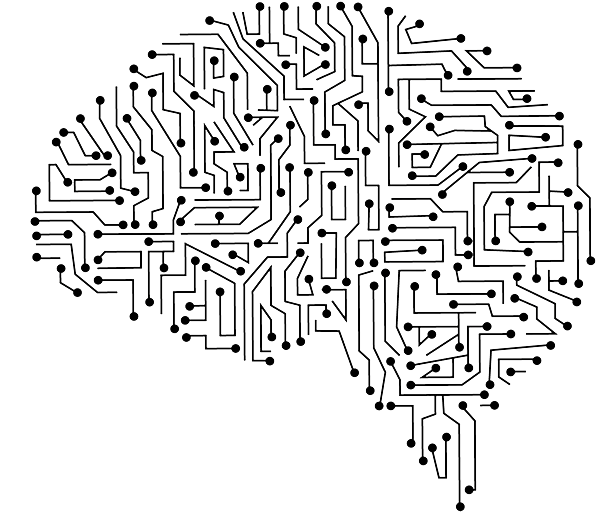

<!-- <p align="center"> 
  
</p> -->
<h1 align="center"> Imageful </h1>
<h3 align="center"> COMP 1734420 - Artificial Intelligence </h3>
<h5 align="center"> Course Practical Homeworks - <a href="https://english.iut.ac.ir/">Isfahan University of Technology</a> (Winter & Spring 2022) </h5>

<p align="center"> 
  
</p>

<!-- TABLE OF CONTENTS -->
<h2 id="list-of-problems"> 📖 List of Problems</h2>

<details open="open">
  <summary>List of Problems</summary>
  <ol>
    <li><a href="#rubik's-cube"> ➤ Rubik's Cube (Using Local Search Techniques)</a></li>
    <li><a href="#graph-coloring"> ➤ Graph Coloring (Using Tabu Search)</a></li>
    <li><a href="#my-method"> ➤ My Method</a></li>
    <li><a href="#results"> ➤ Results</a></li>
    <li><a href="#references"> ➤ References</a></li>
    <li><a href="#credits"> ➤ Credits</a></li>
  </ol>
</details>


<!-- ABOUT THE PROJECT -->
<h2 id="rubik's-cube"> 🧠 Rubik's Cube (Using Local Search Techniques)</h2>

<p align="justify">
  The Rubik's Cube is a challenging puzzle with numerous possible combinations, and solving it requires a systematic approach. In this report, we present a program written in python that uses local search techniques to solve the Rubik's Cube. The program takes as input the initial arrangement of the Rubik's Cube, represented as a 3x3 matrix with numbers from 1 to 6, obtained from a file (Rubik’s Cube Input.txt). The faces of the cube (White, Green, Red, Blue, Orange, and Yellow) are received in the order depicted in below figure.
  
<p align="center"> 
  
</p>

  Upon successfully solving the Rubik's Cube for about three moves, the program outputs the final configuration and the movements performed to achieve it. A total of 12 movements are considered for rotating the cube's faces. When a face is rotated clockwise, it is denoted by the first letter of its name (e.g., U for Up), and counterclockwise rotations are denoted with a prime symbol (e.g., U' for counterclockwise Up).

  To tackle this problem, we employ the Simulated Annealing (SA) algorithm. Each possible move out of the 12 available is considered as a neighbor in the current state of the cube. Therefore, at each step, 12 neighbors are generated. We also define a fitness function, which counts the number of cells in their correct positions, as our objective. We choose the following scheduling function ($t$ stands for temperature):
  $$\frac{1}{\log t}$$
  which starts with an initial temperature of 1000 and decreases by 1 unit in each step.

  For each of the 12 possible movements on the Rubik's Cube, we define a function. It is important to note that clockwise movements are represented without a quotation mark, and counterclockwise movements without a period (e.g., U for Up and U' for counterclockwise Up). Additionally, the getNeighbors function is used to retrieve neighboring states, and the calcValue function calculates the fitness value.

  Our program successfully solves the Rubik's Cubes which deviate from its solved state by at most two moves and some by three and provides the final configuration in the same format as the input, as well as the sequence of movements used to achieve the solution.

[](https://github.com/Alireza-Abrehforoush/Homework/blob/master/6th%20sem/Artificial%20Intelligence/1/P/sources/Rubik.py)

</p>


<!-- PROJECT FILES DESCRIPTION -->
<h2 id="graph-coloring"> 🧠 Graph Coloring (Using Tabu Search)</h2>

<p align="justify">

  The Graph Coloring Problem entails assigning the minimum number of colors to the vertices of a graph such that adjacent vertices do not share the same color. In this report, we present a program written in a commonly used programming language that employs local search techniques, specifically the Tabu Search algorithm, to solve the Graph Coloring Problem.

  The program takes its input from a file (Graph Coloring Input.txt) and consists of the following components:

  1. The number of vertices.
  2. The number of edges.
  3. The numbering of the endpoints of each edge (vertices are numbered starting from 1).

  The program has a time limit of one minute to find the solution. It aims to determine the minimum number of colors required to color the vertices while ensuring that adjacent vertices have different colors. Additionally, it assigns a color number to each vertex (color numbers start from 1).

  To address the Graph Coloring Problem, we utilize the Tabu Search algorithm. The algorithm begins with an initial state where each vertex is assigned a unique color, equal to the number of vertices in the graph. In each iteration, the algorithm explores neighbors that do not violate the constraint of adjacent vertices having the same color. It selects the neighbor with the minimum possible number of colors as the next state.The provided Python code implements the Tabu Search algorithm for the Graph Coloring Problem. Key functions include:

  🪛 ```getPossibleNeighbors```: Identifies neighbors (new color assignments for vertices) that do not violate adjacency constraints.

  🪛 ```calcValue```: Calculates the number of unique colors used in the current state.

  🪛 ```sls```: Implements the Tabu Search algorithm, selecting the best neighbor as the next state.

  🪛 ```main```: Reads input, constructs the adjacency matrix, initializes colors, and runs the Tabu Search algorithm until the one-minute time limit is reached.


[](https://github.com/Alireza-Abrehforoush/Homework/blob/master/6th%20sem/Artificial%20Intelligence/1/P/sources/Graph.py)

</p>

<!-- <ul>
  <li><b>cair.m</b> - Where all of the functions reside.</li>
  <li><b>main.m</b> - The main file that runs the algorithm.</li>
</ul> -->

<!-- <h3>Some other supporting files</h3>
<ul>
  <li><b>graphicsDisplay.py</b> - Graphics for Pacman.</li>
</ul> -->


<!-- GETTING STARTED -->
<!-- <h2 id="getting-started"> 📖 Getting Started</h2>

<p>You are able to start the game by typing the following commands in the command line:</p>
<pre><code>$ python pacman.py</code></pre>

<p>You can see the list of all options and their default values via:</p>
<pre><code>$ python pacman.py -h</code></pre>
<i>Note that all of the commands that appear in this project also appear in <code>commands.txt</code>, for easy copying and pasting.</i>

 -->

<!-- MY METHOD -->
<h2 id="my-method"> 💡 My Method</h2>

<p align="justify"> 
  As the classic seam carving algorithm was vulnerable to some properties of the images, such as the noisiness of the background and the existence of geometric structures, I modified the classic seam carving algorithm to make it convenient for a bigger group of images.

  Generally speaking, my method consists of two main parts: first, modification of the seam carving algorithm, and second, providing a new importance map, both of which enhance the overall visual result.

1.
    While removing the seam having the least importance value in the importance map, it is sensible in the next iteration not to remove the seam containing adjacent pixels to the pixels of the removed seam in order to avoid distortions caused by the removal of adjacent seams. To handle this situation, I encountered that it would be beneficial to add a constant factor of the importance value of removed pixels to its adjacent ones. This trick works because in every iteration (respectively seam removal step), the seam with the minimum importance is chosen to be removed. So when we increase the importance of the pixels adjacent to the removed seam, it becomes more probable for the next seam not to consist of pixels adjacent to the previously removed seam. Therefore, in each iteration, I add 0.491/2 times x to each adjacent pixel's importance value on the right and left and 0.009/2 to each second-order adjacent importance value on the right and left.

2.
    The importance map used in this method is calculated through a linear combination of the normalized depth map, saliency map, gradient magnitude, and the maximum of values obtained by applying two 3 by 3 diagonal Sobel operators regarding edges of 45 or 135 degrees. The importance map is obtained as follows:
 $$map_{importance} = 3 nrml(map_{depth}) + nrml(map_{saliency\:map}) + nrml(map_{gradient\:magnitude}) + 3 nrml(max(map_{45\:degree\:Sobel}, map_{135\:degree\:Sobel}))$$
</p>


<!-- Results -->
<h2 id="results"> 🎉 Results</h2>

<p align="justify"> 
  After applying my method to the provided images, here are the corresponding outputs that demonstrate a 50% reduction in width.
</p>

<div style="display: flex; justify-content: center;">
  
  <span style="margin: 0 10px; display: flex; justify-content: center; align-items: center;">--------------></span>
  
</div>
<div style="display: flex; justify-content: center;">
  
  <span style="margin: 0 10px; display: flex; justify-content: center; align-items: center;">--------------></span>
  
</div>
<div style="display: flex; justify-content: center;">
  
  <span style="margin: 0 10px; display: flex; justify-content: center; align-items: center;">--------------></span>
  
</div>
<div style="display: flex; justify-content: center;">
  
  <span style="margin: 0 10px; display: flex; justify-content: center; align-items: center;">--------------></span>
  
</div>


<!-- <p>I have implemented the depth-first search (DFS) algorithm in the depthFirstSearch function in <code>search.py</code>.</p>
<p>The Pacman will quickly find a solution via running the following commands:</p>

<pre><code>$ python pacman.py -l tinyMaze -p SearchAgent</code></pre>
<pre><code>$ python pacman.py -l mediumMaze -p SearchAgent</code></pre>
<pre><code>$ python pacman.py -l bigMaze -z .5 -p SearchAgent</code></pre> -->

<!-- <p align="center"> 

height="382px" width="737px"
</p> -->


<!-- REFERENCES -->
<h2 id="references"> 🌏 References</h2>

[1] Asheghi, Bahareh, et al. "A comprehensive review on content-aware image retargeting: From classical to state-of-the-art methods." Signal Processing 195 (2022): 108496.


<!-- CREDITS -->
<h2 id="credits"> 📜 Credits</h2>

Alireza Abrehforoush

[](https://github.com/Alireza-Abrehforoush)
[](https://www.linkedin.com/in/alireza-abrehforoush-b6815b19b/)

<!-- Acknowledgements: Based on UC Berkeley's Pacman AI project, <a href="http://ai.berkeley.edu">http://ai.berkeley.edu</a> -->

