<!-- 
 
  

 -->
<h1 align="center"> CVHW </h1>
<h3 align="center"> COMP 1730460 - Foundations of Computer Vision</h3>
<h5 align="center"> Course Homeworks - <a href="https://english.iut.ac.ir/">Isfahan University of Technology</a> (Winter & Spring 2022) </h5>

 
  

<!-- TABLE OF CONTENTS -->
<h2 id="list-of-problems"> 📖 List of Homeworks</h2>

  
List of Homeworks

  <ol>
    <li><a href="#hw1"> ➤ Homework 1</a></li>
    <li><a href="#hw2"> ➤ Homework 2</a></li>
    <li><a href="#hw3"> ➤ Homework 3</a></li>
    <li><a href="#hw4"> ➤ Homework 4</a></li>
    <li><a href="#hw5"> ➤ Homework 5</a></li>
    <li><a href="#hw6"> ➤ Homework 6</a></li>
    <li><a href="#credits"> ➤ Credits</a></li>
  </ol>

<!-- HOMEWORK 1 -->
<h2 id="hw1"> 👁️ HOMEWORK 1</h2>

## Problem 1

In the field of computer vision and image processing, one of the foundational tasks is reading an input image within a programming environment and accessing its data. In this exercise, we explored the process of reading and displaying image data from a PPM file format using MATLAB. Additionally, we assessed the correctness of our approach by utilizing the "imread" command and presenting two results side by side.

 
  

### Reading Image Data

To begin, we opened the image file using a text editor. Based on the provided information, the image has dimensions of 1282 × 852 pixels, and the maximum brightness level for each color channel of every pixel is 255. From this, we deduced that the image data starts from the seventeenth byte onward.

### Accessing Image Data

We proceeded to open the image using both the "fopen" and "fread" commands as well as the "imtool" command. Upon closer examination of the image, it became evident that our initial assumption about the location of the image data was accurate. The brightness level of the first pixel of the image data is stored in the seventeenth byte of the file. Furthermore, comparing the output of the "imtool" command to an array representing the file, we observed that the brightness levels for the red, green, and blue channels were respectively stored at indices that are multiples of 3, offset by 2, 3, and 1.

This exercise demonstrated the fundamental process of extracting image data from a PPM file and accessing it within a MATLAB environment. Additionally, it highlighted the importance of validation through tools like "imread" to ensure the accuracy of the data extraction process. This experience underscores the essential skills and understanding of image processing techniques, file manipulation, and data validation, all of which are valuable assets in the realm of computer vision and related fields.

## Problem 2

In this image processing task, we were given a PPM image as input and were tasked with generating a new image according to specific guidelines. The resulting image consists of three distinct regions: an outer elliptical region in grayscale, a region between the ellipse and the lozenge filled with red color, and an untouched inner lozenge region derived from the original image. The output image is saved in JPG format, and its integrity is verified by opening it in a Windows environment.

### Input Image

 
  

### Image Transformation

To achieve this, we followed a step-by-step approach:

1. Grayscale Conversion: We began by converting the input image into grayscale. This step simplifies subsequent color modifications.

2. Red Coloring for the Ellipse: The outer elliptical region of the image was filled with a red color. To determine the dimensions of the ellipse, we set its width to 400 pixels and height to 800 pixels. Here is the formula for an ellipse:
$$\frac{{(x - x_0)^2}}{{a^2}} + \frac{{(y - y_0)^2}}{{b^2}} = 1$$

3. Lozenge Creation: The inner lozenge region was retained from the original image. The horizontal and vertical diameters of the lozenge were set to 200 and 400 pixels, respectively. The lozenge's shape and dimensions were derived using geometric equations. Here is the formula for an lozenge:
$$\left| \frac{{x - x_0}}{{d_h/2}} \right| + \left| \frac{{y - y_0}}{{d_v/2}} \right| = 1$$

4. Final Output: The result was saved in JPG format, ensuring that the image was correctly stored. We verified its integrity by opening it in a Windows environment.

This exercise demonstrates proficiency in image manipulation, including grayscale conversion, region-specific coloring, and geometric transformations. The ability to apply mathematical principles to image processing tasks is a valuable skill in the field, showcasing the capacity to solve complex problems and create visually appealing graphics programmatically.

### Output Image

 
  

## Problem 3

In this problem, the objective is to rotate a color image by a user-defined angle (θ) without using built-in rotation commands like "imrotate." Instead, we utilize rotation matrices for the transformation.

### Calculate New Dimensions
To calculate the new dimensions (height and width) of the rotated image:
$$
\begin{align*}
\text{New Height (hnew)} & = \lceil |w \cdot \sin(\theta)| + |h \cdot \cos(\theta)| \rceil \\
\text{New Width (wnew)} & = \lceil |h \cdot \sin(\theta)| + |w \cdot \cos(\theta)| \rceil
\end{align*}
$$

### Rotation Matrix
The rotation matrix for a 2D transformation is:
$$\begin{bmatrix}
\cos(\theta) & -\sin(\theta) \\
\sin(\theta) & \cos(\theta)
\end{bmatrix}$$

These equations provide the mathematical foundation for calculating the new dimensions of the image and performing pixel-wise rotation using the rotation matrix. The task is accomplished by the "rotateImage" function.

Here is the rotation for 60 degrees:

 
  

<!-- HOMEWORK 2 -->
<h2 id="hw2"> 👁️ HOMEWORK 2</h2>

## Problem 3
### Part A
In this task, the goal was to develop a function that generates a grayscale image corresponding to a given color input image in a way that maximizes the Peak Signal-to-Noise Ratio (PSNR), a crucial metric for image quality assessment.

#### Code Overview

The provided code accomplishes this task by converting a color image (in RGB format) into a grayscale image while aiming to achieve the highest possible PSNR. Here's an overview of the code's functionality:

 - The function "toBlackWhite" is defined to create the grayscale image.
 - The input image, "I," is processed to generate the corresponding grayscale image, "J."

#### Grayscale Conversion Strategy

The core of the algorithm lies in the grayscale conversion strategy. For each pixel in the input color image, the code calculates the average of the RGB channels (red, green, and blue) and rounds it. This average value is then used to determine whether the pixel in the grayscale image should be set to white (255) or black (0). The decision is based on which color (white or black) is closer to the average of the RGB channel.

### Input Image

 
  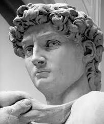

### Output Image

 
  

### Part B
In this task, the objective was to write a function that converts a color image into a black and white image using the Floyd-Steinberg dithering algorithm. The goal of this algorithm is to determine whether each pixel should be black or white, aiming to preserve visual details while achieving a desirable result in terms of image quality.

#### Code Overview

The provided code accomplishes this task by implementing the Floyd-Steinberg dithering algorithm to convert a color image into grayscale and then to black and white. Here's an overview of the code's functionality:

  - The function "floydSteinberg" is defined to perform the dithering.
  - The input color image, "I," is first converted to an integer representation.
  - A new matrix, "J," of the same size as the input image is created to store the resulting black and white image.
  - The algorithm iterates through each pixel of the image, from left to right and from top to bottom.

#### Dithering Strategy

The core of the algorithm lies in the dithering strategy. For each pixel in the input color image, the code calculates the pixel's luminance or brightness. Based on this luminance value, the pixel is assigned either black (0) or white (255).

#### Error Diffusion

To minimize information loss and preserve visual quality, error diffusion is employed. Any error resulting from the decision made for the current pixel (e.g., changing a grayscale value to 255 or 0) is distributed to neighboring pixels. The error is diffused according to specific weighted coefficients defined by the Floyd-Steinberg algorithm.

### Input Image

 
  

### Output Image

 
  

## Problem 4

In this task, the objective was to create a function that implements the Bilinear image resizing algorithm without using built-in resizing commands like "imresize." The function, named "My_Imresize_BL," takes an input image and a resizing factor as parameters.

### Code Overview

The provided code accomplishes this task by performing the Bilinear resizing algorithm on the input image. Here's an overview of the code's functionality:

  - The function "My_Imresize_BL" is defined to implement the Bilinear resizing.
  - The resizing factor, "Resizing_Factor," can be greater or less than one.
  - The code calculates the new dimensions of the output image based on the resizing factor.
  - A new matrix, "J," of the computed dimensions is created to store the resulting image.
  - Bilinear interpolation is applied to determine the pixel values in the resized image.

### Resizing Process

The core of the algorithm involves mapping each pixel in the output image to its corresponding position in the input image. Bilinear interpolation is used to calculate the pixel values in the resized image by considering the neighboring pixels in the original image.

### Input Image

 
  

### Output Image (70 percent reduction)

 
  

## Problem 5

### Introduction
In this project, I developed an image resizing and enhancement algorithm designed to improve the quality of grayscale images by resizing them using a constant resizing factor of 2. The primary goal was to assess the accuracy and effectiveness of this proposed method. To ensure a comprehensive evaluation, a set of original images was provided, with every other pixel removed. The missing pixels were then replaced to reconstruct the images, using the proposed method and implementation. The final evaluation of the methods was carried out on a set of images that were not provided initially, to avoid any dependence on the given dataset.

### Methodology
The proposed method involves resizing and enhancing grayscale images, adhering to specific steps. Firstly, the missing pixels in the images were interpolated. This was achieved by averaging the brightness levels of neighboring pixels, with a window of 4 pixels around the missing pixel. For pixels located on the image's boundary, having two diagonal neighbors, a similar technique was applied.

 
  

Next, the brightness levels of the remaining pixels were interpolated by averaging the values of their neighboring pixels, both horizontally and vertically (above, below, left, and right). Similar to the boundary pixels, the algorithm handled the corner pixels in the same manner. The algorithm's implementation can be found in the "doubleDimensions" function.

 
  

### Results
To evaluate the effectiveness of this resizing and enhancement method, I executed the algorithm on a set of test images with resizing factor of two and recorded the results. The results, including execution time and PSNR values, are summarized in the table below:

| Image        | Nearest neighbor (dB) | Bilinear (dB)  | Bicubic (dB) | My method (dB) | Execution time (seconds)    |
|--------------|------------------|-----------|----------|-----------|------------|
| Boat         | 25.5147          | 27.104    | 26.9296  | 28.8864   | 0.899658   |
| Peppers      | 28.1116          | 29.949    | 29.7193  | 32.1106   | 0.941563   |
| Cameraman    | 28.0316          | 30.3392   | 30.4896  | 34.6318   | 0.913748   |
| House        | 27.5452          | 29.3679   | 29.2722  | 31.5815   | 0.228155   |
| Average PSNR | 27.30075         | 29.190475 | 29.102675| 31.802575 |            |

## Problem 6
### Part A
In this task, I wrote a function that gets a grayscale image in the input and outputs its histogram. The function is executed for the following image.

 
  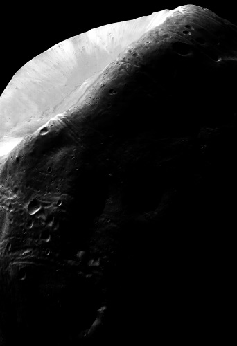

 
  

### Part B
#### Introduction
In this project, I focused on improving the visual quality of an image, Image.tif, by employing histogram analysis techniques and applying appropriate transformations. The goal was to enhance the image to reveal the maximum level of detail while maintaining a balanced contrast. The "imadjust" function was used to facilitate this enhancement process. In this report, I will explain the analysis method and the transformation functions applied in detail.

#### Histogram Analysis
As observed in the histogram of the Image.tif, the pixel intensities are predominantly concentrated around zero and close to 255. This distribution indicates that a significant portion of the image is either very dark or very bright. To enhance the image quality for both low and high brightness levels, an appropriate transformation function is required.

#### Transformation Functions

1. Logarithmic Transformation:
For improving the quality of the image in regions with low brightness levels (pixel intensities less than k), a logarithmic transformation function is a suitable choice. This function expands the range of low brightness levels while preserving the approximate brightness levels of the high-intensity regions. The specific logarithmic transformation function used is:
$$J = 31.875 × log(I + 1)$$

1. Inverse Logarithmic Transformation:
To enhance the quality of the image in regions with high brightness levels (pixel intensities greater than k), the inverse logarithmic transformation is applied. This transformation function widens the range of high-intensity regions while maintaining the approximate brightness levels of the low-intensity regions. The transformation parameters used for enhanced clarity in the bright regions are:
     - Gamma value (γ) set to 1.2
     - k value set to 127
     The inverse logarithmic transformation function is defined as:
     $$J = \frac{1}{255} × I^2$$

Here is the enhanced image:

 
  

<!-- HOMEWORK 3 -->
<h2 id="hw3"> 👁️ HOMEWORK 3</h2>

## Problem 3

### Introduction
In this project, I developed algorithms to calculate the sum of the digits within each image in a given database. The challenge was to consider the sign associated with each digit's color and display the result at the bottom of the same image in green. Positive numbers were represented in red, while negative numbers were represented in blue. The accuracy of the algorithm was assessed in terms of the percentage of correct calculations.

### Algorithm Description
The first step in this algorithm involves generating blue and red reference images for digits 1 to 9, which serve as preprocessing steps. Each image in the database is then processed as follows:

 1. Finding the Digit's Position:
 The algorithm reads the image and, at each iteration, identifies the top-leftmost location of a color pixel (either blue or red) within the image. This pixel's position corresponds to the digit's location.

 1. Calculating the Mean Square Error (MSE):
 The algorithm calculates the Mean Square Error (MSE) between the identified portion of the image and all the reference digits generated in the preprocessing step. This helps in determining the digit that the color pixel represents. The reference digits are resized to match the dimensions of the identified portion using image resizing techniques.

 1. Identifying the Digit:
 The digit with the minimum MSE value, which is highly likely to correspond to the digit in question, is added to the array of digits within the image. The identified portion is then masked to prevent it from affecting the detection of subsequent digits.

 1. Repeat for All Digits:
 This process is repeated until all digits within the image are detected. Each digit is added to the array of digits, and the detected portion is blacked out to ensure that the next digit is found accurately.

 1. Calculating the Sum:
 After all digits are identified, the algorithm calculates their sum with 100% accuracy.

### Results

#### Input

 
  

#### Output

 
  

The developed algorithm successfully calculates the sum of digits within images while considering the color coding for positive and negative numbers. The algorithm's high accuracy, achieving 100% correct results, demonstrates its reliability and efficiency. This skillset can be a valuable asset in various applications, including optical character recognition (OCR) and image analysis, contributing to the success of future projects and endeavors.

Note: The accuracy here refers to the percentage of times the algorithm correctly calculates the sum of digits in the given images.

## Problem 4

### Introduction
In this task, I proposed a custom noise reduction method for salt and pepper noise and compared its performance with the median filter on four provided images. The goal was to complete the table below, showcasing the effectiveness of the proposed method. To provide a comprehensive explanation, I will use a block diagram or pseudocode to describe the recommended approach. Note: For comparison, consider the size of the median filter in each case to be equal to the neighborhood size used in your method for that case.

### Algorithm Description
For each pixel affected by salt and pepper noise (with brightness levels 0 and 255), we consider a 3x3 kernel centered around that pixel. We then replace the pixel's brightness value with the average brightness of its noise-free neighbors within the 3x3 kernel (if such neighbors exist). The brightness levels of other pixels (either with all noisy neighbors or without noise themselves) remain unchanged.

Assuming that the original image doesn't contain a significant number of pixels with brightness levels 0 or 255 (or only has a few), we iterate the algorithm until no pixels with brightness levels 0 or 255 remain in the image.

Note that the efficiency of this algorithm depends on the noise level and its spatial distribution in the image. In cases where the original image has a high proportion of pixels with brightness levels 0 or 255, this algorithm may not perform efficiently. Also, in time-critical applications, where execution time is crucial, the algorithm's efficiency may be a concern due to its potential need for multiple iterations.

### Results
The custom noise reduction algorithm effectively mitigates salt and pepper noise by averaging pixel values within a 3x3 neighborhood. While it can improve image quality in scenarios where noise is sporadic, its efficiency may vary depending on the noise distribution and the presence of many pixels with extreme brightness levels. Understanding the strengths and limitations of this algorithm is essential for its practical application in image processing tasks. The following table shows the PSNR values regarding different noise percentages and also compares my method and 3x3 median filter.

| Noise Percentage | Bridge - Median (dB) | Bridge - My Method (dB) | Boat - Median (dB) | Boat - My Method (dB) | Peppers - Median (dB) | Peppers - My Method (dB) | House - Median (dB) | House - My Method (dB) |
|------------------|-----------------------|--------------------------|--------------------|-----------------------|------------------------|---------------------------|--------------------|-----------------------|
| 10%              | 34.2685               | 35.5608                  | 36.9305            | 38.4299               | 39.5897                | 39.8929                   | 37.5208            | 41.2446               |
| 20%              | 29.1947               | 32.351                   | 30.8115            | 35.103                | 31.6369                | 36.9182                   | 30.8793            | 38.0098               |
| 30%              | 24.2216               | 30.3418                  | 24.9933            | 33.0565               | 25.7074                | 35.0742                   | 25.3376            | 35.603                |
| 40%              | 19.8592               | 28.7748                  | 20.402             | 31.3515               | 20.7401                | 33.0959                   | 20.3952            | 33.6473               |
| 50%              | 16.2266               | 27.2865                  | 16.6014            | 29.916                | 16.5719                | 31.6668                   | 16.4084            | 31.8117               |
| 60%              | 13.1765               | 25.888                   | 13.403             | 28.442                | 13.3855                | 30.1246                   | 13.6071            | 30.3997               |
| 70%              | 10.6323               | 24.3311                  | 10.9112            | 26.7086               | 10.7682                | 28.1435                   | 10.8164            | 28.2111               |
| 80%              | 8.4913                | 22.5335                  | 8.7927             | 24.7861               | 8.6039                 | 25.9394                   | 8.758              | 25.6044               |
| 90%              | 6.7577                | 20.0949                  | 6.9537             | 21.8315               | 6.8026                 | 22.3678                   | 6.9176             | 22.6665               |
| **Mean**         | **18.0921**           | **27.4625**              | **18.8666**        | **29.9583**           | **19.3118**            | **31.4693**                | **18.96**           | **31.9109**           |

Note: The completed table, comparing the proposed method and the median filter's performance on the provided images, would provide a visual representation of the algorithm's effectiveness.

<!-- HOMEWORK 4 -->
<h2 id="hw4"> 👁️ HOMEWORK 4</h2>

## Problem 3

### Introduction

In this project, I developed a program to solve a puzzle image composed of square pieces of the same size, each labeled with random names, and generate the original image. The program outputs a visually coherent arrangement of puzzle pieces, allowing the user to visualize the puzzle-solving process. For simplicity, four corner pieces have been provided in the output image named "Output.tif." The original image, labeled "Original.tif," is given to you solely for result evaluation. After completing the task, the program can compare the generated image with the original image, providing accuracy feedback to the user. In addition to the mentioned images, there is an image named "Shuffled_Patches.tif," which depicts a jumbled puzzle and is not intended for solving the problem. You are required to explain your proposed method and provide the code along with a block diagram for clarity. The number of pieces in each puzzle is specified in the folder name:
a) Solve the problem for a 40-piece puzzle (Puzzle_1_40).
b) Optionally and for extra points, solve the problem for a 160-piece puzzle (Puzzle_2_160).

### Algorithm Description
To begin, we fix the four corner pieces of the puzzle image. To find the piece corresponding to the current position, we utilize edge similarity measurements between pieces. For assessing the similarity between two puzzle pieces within the same row (column), we compute feature vectors for the piece on the left (above) by equating the brightness levels of the right (bottom) edge pixels of the left (above) piece to the left (above) edge pixels of the right (bottom) piece. We start traversing the image from the top-left corner, calculating the Euclidean distance squared between feature vectors of the gray-scale version of all available pieces and the gray-scale version of the fixed piece. The minimum of these distances corresponds to the piece that shares the highest edge similarity with the fixed piece.

### Results

#### 40-piece

##### Input

 
  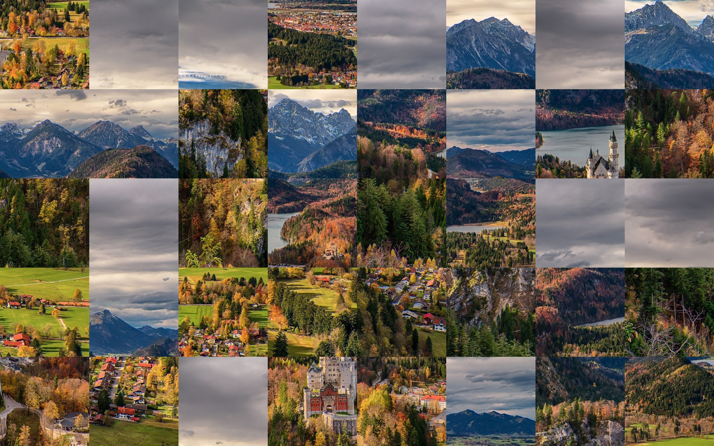

##### Output

 
  

#### 160-piece

##### Input

 
  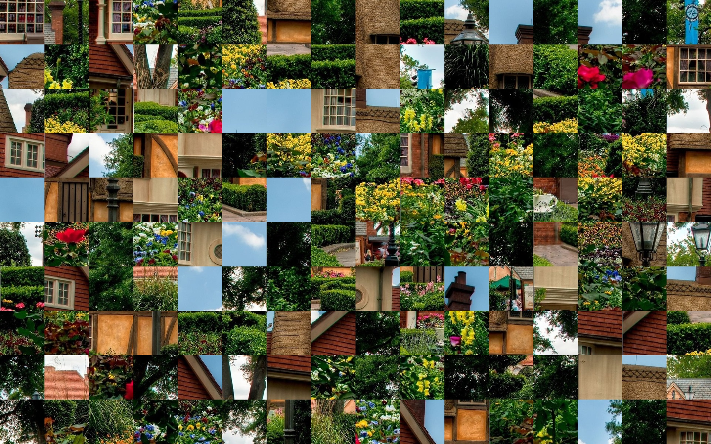

##### Output

 
  

Note: The efficiency of this algorithm may vary depending on the distribution of puzzle pieces and their edge similarities. In cases where the original image contains a significant number of pixels with extreme brightness levels, the algorithm may face challenges.

<!-- HOMEWORK 4 -->
<h2 id="hw4"> 👁️ HOMEWORK 4</h2>

## Problem 2

### Part A

#### Introduction
In this part, I have developed a custom cell counting algorithm for grayscale-like images, similar to the attached image. The objective is to design and implement a function that counts cells without utilizing the built-in bwlabel function or similar commands. This custom algorithm provides an alternative approach to accurately count cells within an image, which can be applied to various fields, including biology, medical imaging, and quality control.

#### Algorithm Description
The custom cell counting algorithm operates recursively, systematically identifying and counting individual cells within the grayscale image. Here is a step-by-step description of the algorithm:

 1. Initialize the algorithm by selecting a 3x3 neighborhood around each pixel in the image.

 2. For each white (cell) pixel within the neighborhood, mark it as black, signifying that it has been processed.

 3. Run the algorithm recursively on the white pixels within the 3x3 neighborhood.

 4. If a white pixel does not have any white neighbors in its neighborhood, increment the cell counter by one. This signifies that a new cell has been detected.

 5. Continue this process until all pixels in the image have been traversed, ensuring that no white pixels remain unprocessed.

 6. To address the issue of cells merging together, we apply an erosion operation with a circular structuring element of radius 5. This operation helps separate cells that might have become connected during the counting process.

#### Test

 
  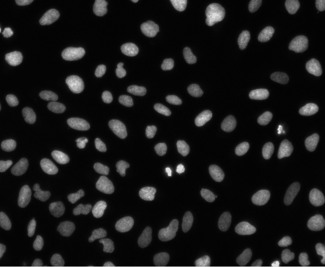

The algorithm outputs 100 for the above image.

### Part B

#### Introduction
In this part, I have developed a custom algorithm for cell labeling and statistics generation in images without using built-in functions like bwlabel or similar commands. The objective is to create a function that takes an image containing cells as input and produces an Excel file with detailed information about each cell, including its area and average brightness level. This algorithm has diverse applications in fields such as biology, medical imaging, and quality control, where cell analysis and characterization are essential.

#### Algorithm Description
The custom cell labeling and statistics generation algorithm operates recursively and systematically labels each cell within the input image while calculating its area and average brightness level. Here is a step-by-step description of the algorithm:

1. Create a map (a matrix of the same size as the input image) to keep track of pixel labels, indicating which region each pixel belongs to.

2. For each white (cell) pixel in the input image, label it and mark it as black in the map, signifying that it has been processed.

3. Run the algorithm recursively on the white pixels within a 3x3 neighborhood of the current pixel.

4. If a white pixel does not have any white neighbors in its neighborhood, increment the region counter by one, signifying the detection of a new cell. This counter corresponds to the cell label.

5. Continue this process until all pixels in the image have been traversed, ensuring that no white pixels remain unprocessed.

6. Calculate the area and average brightness level for each labeled cell by analyzing the corresponding pixels in the input image.

7. Generate an Excel file with the received specifications, including the cell name and address, and store the cell statistics, such as area and average brightness, in rows corresponding to each cell.

## Problem 3

### Introduction
In this challenge, I have proposed and implemented a method for extracting blood vessels in retinal images from the DRIVE database. The primary objective is to calculate key performance metrics, including Specificity, Sensitivity, and Accuracy, for each image in the test set compared to ground-truth results provided by medical experts. Additionally, I will report the average values of these metrics in a comprehensive table. This project addresses an important aspect of medical image analysis and has significant potential applications in the diagnosis and monitoring of eye diseases.

### Algorithm Description
The blood vessel segmentation algorithm consists of several steps to enhance the visibility of blood vessels while reducing noise. Here's a breakdown of the algorithm:

1. Applying a mask to the retinal images to make the background completely black, allowing better contrast for blood vessel detection.

2. Employing an opening operation with a line-shaped structuring element of length 7 in 12 different directions to strengthen fine blood vessels and suppress non-linear noise.

3. Applying unsharp masking to enhance the contrast of the retinal image.

4. Utilizing a thresholding technique to convert the image into a binary black-and-white format. This step aids in isolating the blood vessels.

5. Performing dilation with a line-shaped structuring element of length 6 in the horizontal direction to further enhance the blood vessels.

6. Applying a median filter to reduce noise and refine the segmentation results.

The algorithm is applied to each image in the test set independently, and the resulting binary images are compared with ground-truth data provided by medical experts.

### Block diagram

 
  

### Conclusion
The blood vessel segmentation algorithm presented in this project showcases my expertise in image processing and medical image analysis. By implementing a series of carefully designed steps, the algorithm effectively extracts blood vessels from retinal images. The calculated metrics, including Specificity, Sensitivity, and Accuracy, provide valuable insights into the algorithm's performance compared to manual annotations by medical professionals.

### Results

  
   
  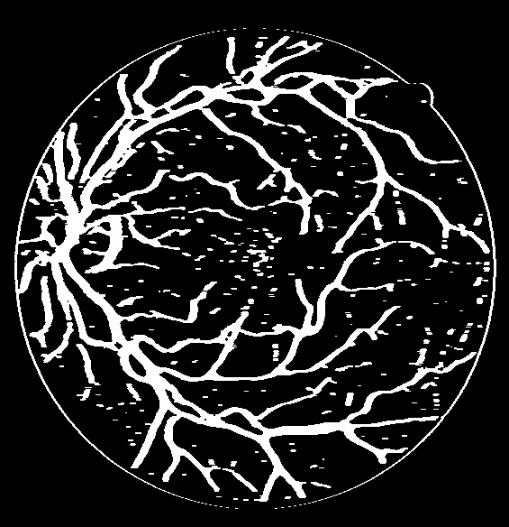

  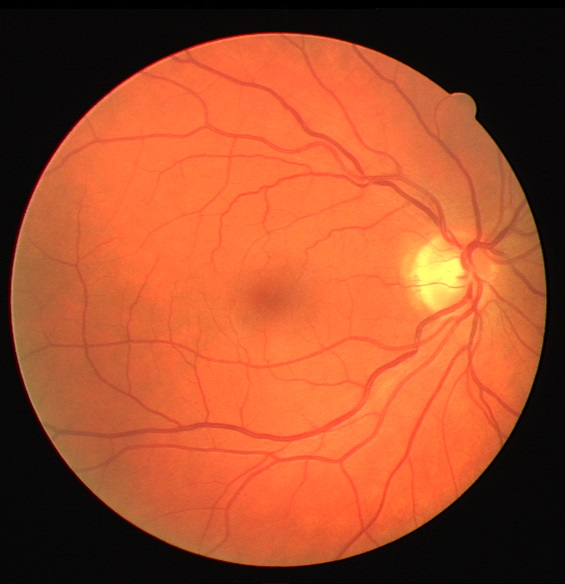
   
  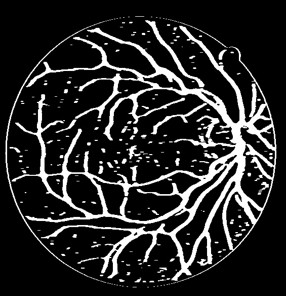

  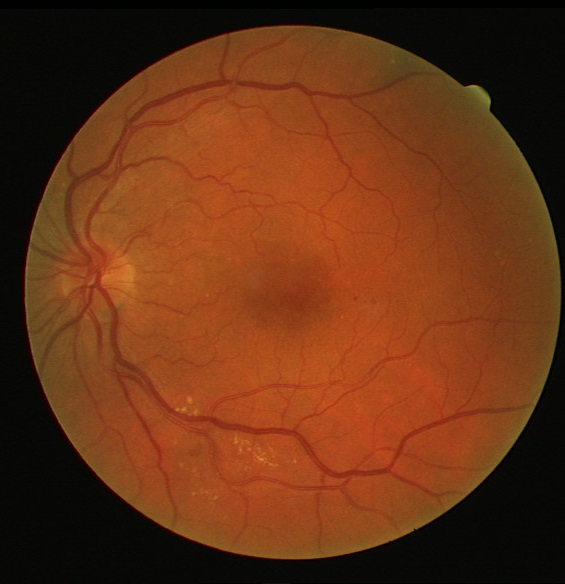
   
  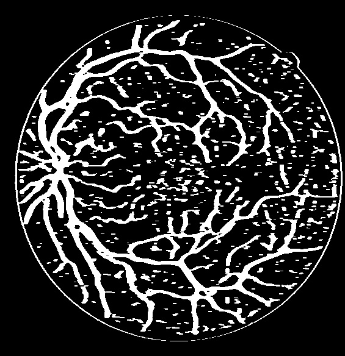

  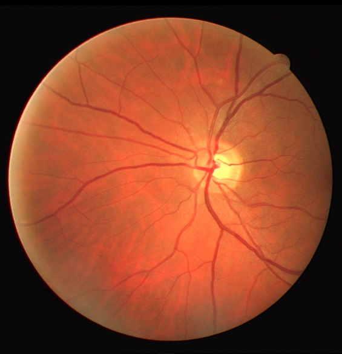
   
  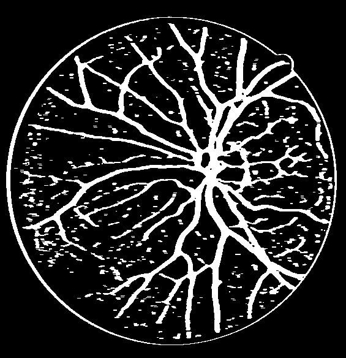

I also tried to enhance this process by new ideas based on K-Means algorithm with $k = 8$. Here are some of my outputs:

  
   
  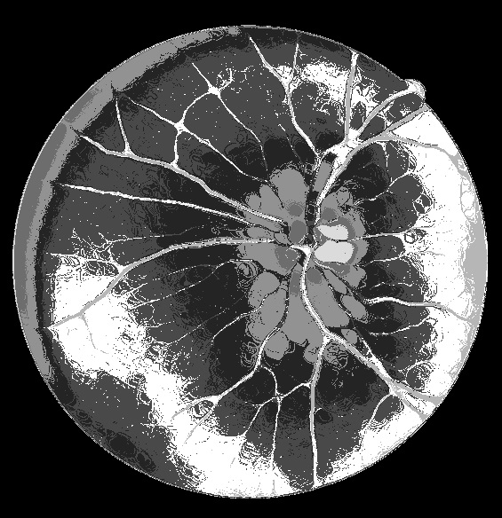

  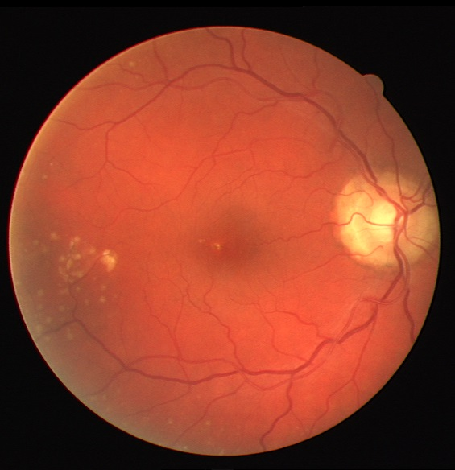
   
  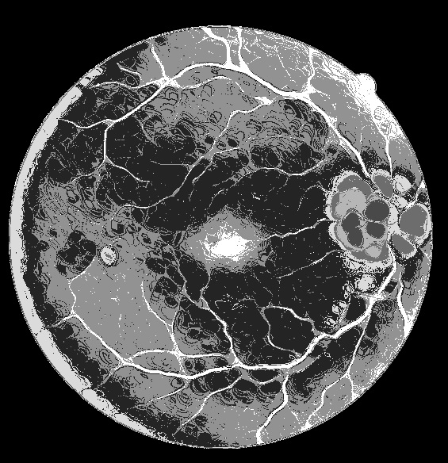

  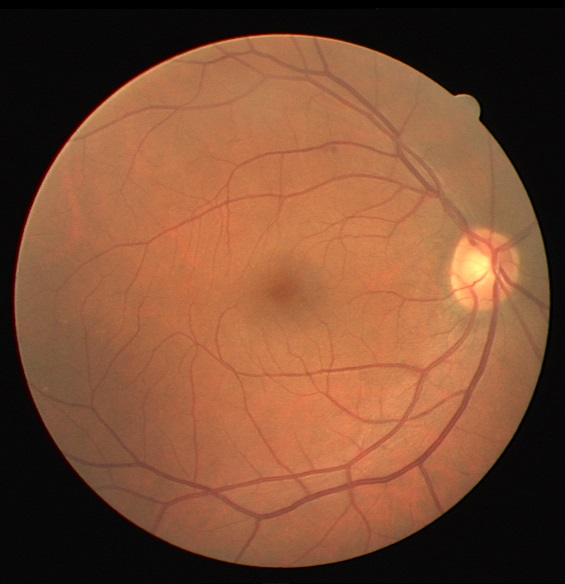
   
  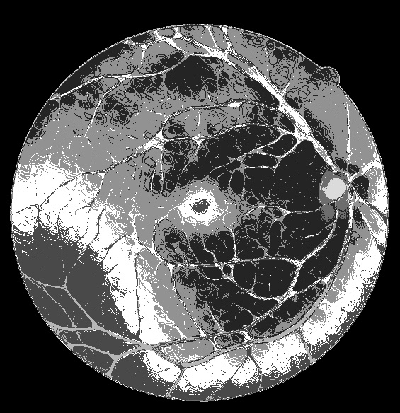

  
   
  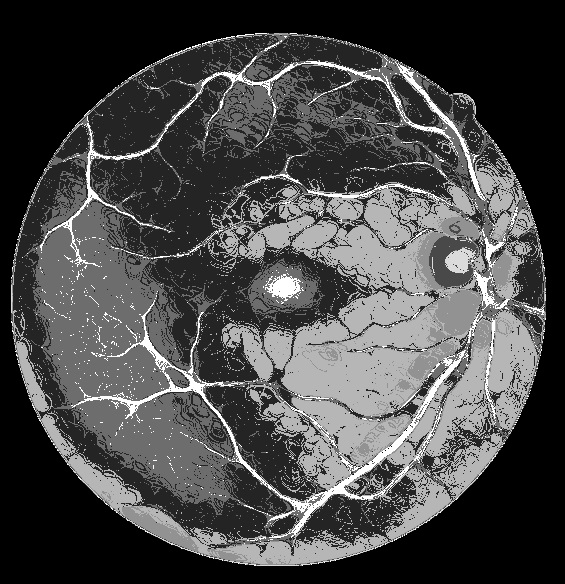

This project has the potential to contribute to the field of ophthalmology by automating blood vessel segmentation, which can aid in the early diagnosis and monitoring of eye diseases. The reported metrics offer a quantitative evaluation of the algorithm's effectiveness, making it a valuable tool for medical research and clinical applications.

<!-- CREDITS -->
<h2 id="credits"> 📜 Credits</h2>

Alireza Abrehforoush

<!-- Acknowledgements: Based on UC Berkeley's Pacman AI project, <a href="http://ai.berkeley.edu">http://ai.berkeley.edu</a> -->

