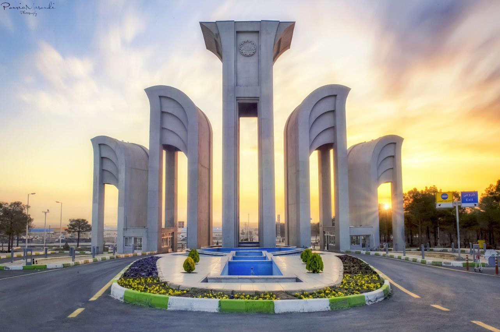

<!-- 
 
  

 -->
<h1 align="center"> CVHW </h1>
<h3 align="center"> COMP 1730460 - Foundations of Computer Vision</h3>
<h5 align="center"> Course Homeworks - <a href="https://english.iut.ac.ir/">Isfahan University of Technology</a> (Winter & Spring 2022) </h5>

 
  

<!-- TABLE OF CONTENTS -->
<h2 id="list-of-problems"> 📖 List of Homeworks</h2>

  
List of Homeworks

  <ol>
    <li><a href="#hw1"> ➤ Homework 1</a></li>
    <li><a href="#credits"> ➤ Credits</a></li>
  </ol>

<!-- HOMEWORK 1 -->
<h2 id="hw1"> 👁️ HOMEWORK 1</h2>

Lorem

## Problem 1

In the field of computer vision and image processing, one of the foundational tasks is reading an input image within a programming environment and accessing its data. In this exercise, we explored the process of reading and displaying image data from a PPM file format using MATLAB. Additionally, we assessed the correctness of our approach by utilizing the "imread" command and presenting two results side by side.

 
  

### Reading Image Data

To begin, we opened the image file using a text editor. Based on the provided information, the image has dimensions of 1282 × 852 pixels, and the maximum brightness level for each color channel of every pixel is 255. From this, we deduced that the image data starts from the seventeenth byte onward.

### Accessing Image Data

We proceeded to open the image using both the "fopen" and "fread" commands as well as the "imtool" command. Upon closer examination of the image, it became evident that our initial assumption about the location of the image data was accurate. The brightness level of the first pixel of the image data is stored in the seventeenth byte of the file. Furthermore, comparing the output of the "imtool" command to an array representing the file, we observed that the brightness levels for the red, green, and blue channels were respectively stored at indices that are multiples of 3, offset by 2, 3, and 1.

This exercise demonstrated the fundamental process of extracting image data from a PPM file and accessing it within a MATLAB environment. Additionally, it highlighted the importance of validation through tools like "imread" to ensure the accuracy of the data extraction process. This experience underscores the essential skills and understanding of image processing techniques, file manipulation, and data validation, all of which are valuable assets in the realm of computer vision and related fields.

## Problem 2

In this image processing task, we were given a PPM image as input and were tasked with generating a new image according to specific guidelines. The resulting image consists of three distinct regions: an outer elliptical region in grayscale, a region between the ellipse and the lozenge filled with red color, and an untouched inner lozenge region derived from the original image. The output image is saved in JPG format, and its integrity is verified by opening it in a Windows environment.

### Input Image

 
  

### Image Transformation

To achieve this, we followed a step-by-step approach:

1. Grayscale Conversion: We began by converting the input image into grayscale. This step simplifies subsequent color modifications.

2. Red Coloring for the Ellipse: The outer elliptical region of the image was filled with a red color. To determine the dimensions of the ellipse, we set its width to 400 pixels and height to 800 pixels. Here is the formula for an ellipse:
$$\frac{{(x - x_0)^2}}{{a^2}} + \frac{{(y - y_0)^2}}{{b^2}} = 1$$

3. Lozenge Creation: The inner lozenge region was retained from the original image. The horizontal and vertical diameters of the lozenge were set to 200 and 400 pixels, respectively. The lozenge's shape and dimensions were derived using geometric equations. Here is the formula for an lozenge:
$$\left| \frac{{x - x_0}}{{d_h/2}} \right| + \left| \frac{{y - y_0}}{{d_v/2}} \right| = 1$$

4. Final Output: The result was saved in JPG format, ensuring that the image was correctly stored. We verified its integrity by opening it in a Windows environment.

This exercise demonstrates proficiency in image manipulation, including grayscale conversion, region-specific coloring, and geometric transformations. The ability to apply mathematical principles to image processing tasks is a valuable skill in the field, showcasing the capacity to solve complex problems and create visually appealing graphics programmatically.

### Output Image

 
  

## Problem 3

In this problem, the objective is to rotate a color image by a user-defined angle (θ) without using built-in rotation commands like "imrotate." Instead, we utilize rotation matrices for the transformation.

### Calculate New Dimensions
To calculate the new dimensions (height and width) of the rotated image:
$$\begin{align*}
\text{New Height (hnew)} & = \lceil |w \cdot \sin(\theta)| + |h \cdot \cos(\theta)| \rceil \\
\text{New Width (wnew)} & = \lceil |h \cdot \sin(\theta)| + |w \cdot \cos(\theta)| \rceil
\end{align*}$$

### Rotation Matrix
The rotation matrix for a 2D transformation is:
$$\begin{bmatrix}
\cos(\theta) & -\sin(\theta) \\
\sin(\theta) & \cos(\theta)
\end{bmatrix}$$

These equations provide the mathematical foundation for calculating the new dimensions of the image and performing pixel-wise rotation using the rotation matrix. The task is accomplished by the "rotateImage" function.

Here is the rotation for 60 degrees:

 
  

<!-- CREDITS -->
<h2 id="credits"> 📜 Credits</h2>

Alireza Abrehforoush

<!-- Acknowledgements: Based on UC Berkeley's Pacman AI project, <a href="http://ai.berkeley.edu">http://ai.berkeley.edu</a> -->

